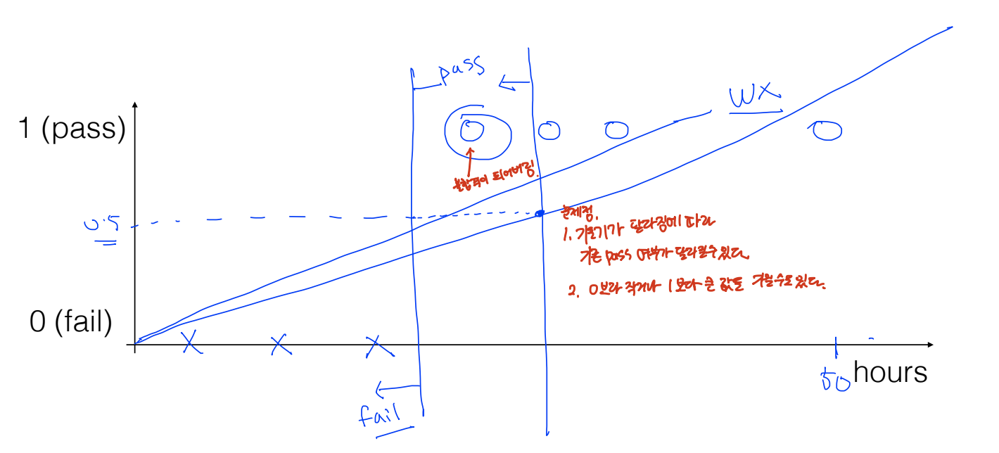
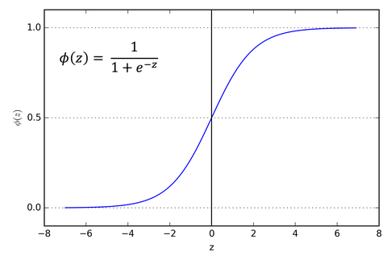
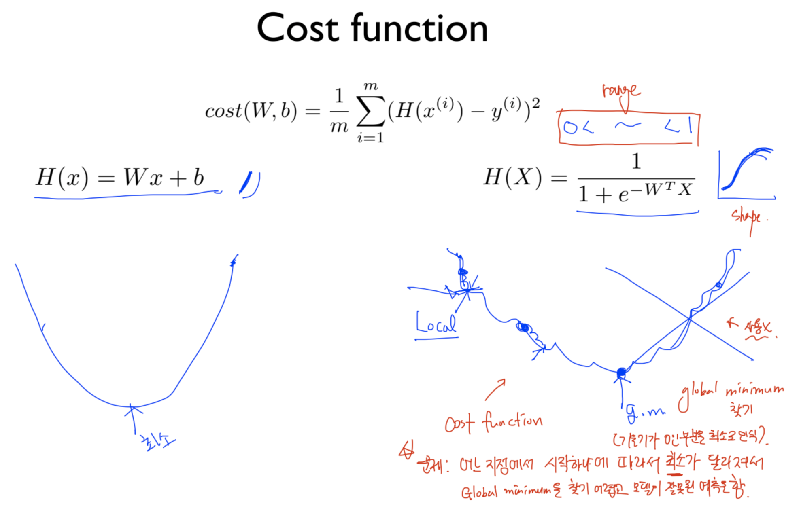
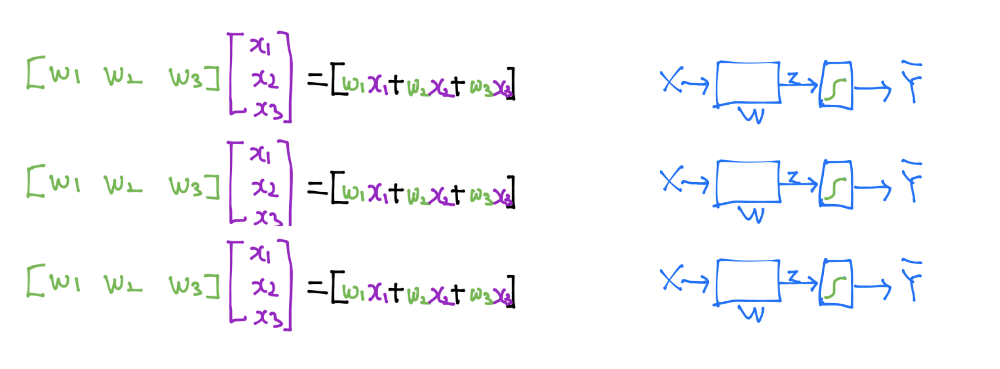
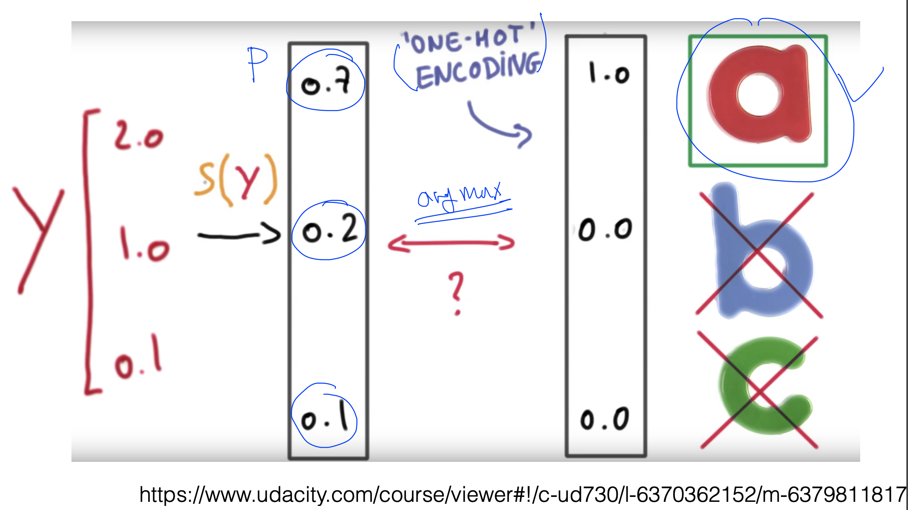
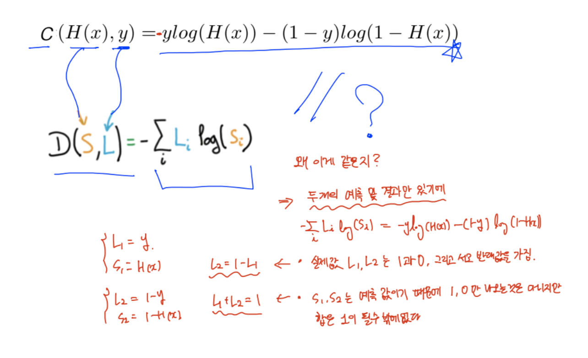

## Logistic Regression 
> 회귀 분석(Logistic regression)은 입력 변수가 주어진 이산형 결과의 확률을 모형화하는 과정입니다. 가장 일반적인 로지스틱 회귀 분석에서는 True/False, Yes/No 등의 두 가지 값을 취할 수 있는 이항 결과를 모형화합니다.

### Classification
0, 1 encoding을 활용하여 이항 결과를 나타냅니다.  

- Spam Detection: Spam(1) or Ham(0) 
- Facebook feed: show(1) or hide(0) 
- Credit Card Fraudulent Transaction detection: legitimate(1)/fraud(0)

#### Linear Regression 한계점

Linear Regression으로 참/거짓을 판단하는 것은 한계점이 존재합니다.
예를 들어, 실제로 Pass에 속한 데이터 값이지만, 기울기가 달라짐에 따라 Fail로 인식될 수도 있다. 

1. 기울기가 달라짐에 따라 기존 Pass 여부가 달라질 수 있다. 
2. 0보다 작거나 1보다 큰 값을 가질 수도 있다. 

### 예측 값의 범위 
Logistic Regression은 0 또는 1로 예측 값을 설정해주어야 합니다. 
하지만, Hypothesis는 1보다 큰 값 혹은 0보다 작은 값이 나올 수 있습니다.  
<strong>그러므로, Logistic Hypothesis가 0 ~ 1 사이의 값이 나오게 하기 위해  sigmoid function 를 사용합니다. </strong> 

 
이미지 출처: https://t1.daumcdn.net/cfile/tistory/275BAD4F577B669920

Logistic Hypothesis를 아래와 같이 설정해주었다고 가정해봅시다. 

### Cost function

<strong>Cost function에 Logistic Hypothesis를 적용해보면, 오른쪽 그림과 같이 극솟값이 여러 개가 존재하게 되어 Global minimum을 찾기 어렵기에 제대로 된 예측을 하기 어렵습니다. </strong> 

이를 해결하기 위해, Logistic을 새로운 Cost function을 아래와 같이 정의할 수 있습니다. (지수함수의 반대인 로그를 활용)

 

cost function을 y과 0일 때와 1일 때를 구분하여 그림을 그려보면, convex function과 유사한 형태를 띄는 것을 확인할 수 있을 것 입니다. 

1. y = 1 일 때, H(x) = 1 -> cost = 0, H(x) = 0 -> cost = 무한대
2. y = 0 일 때, H(x) = 0 -> cost = 0, H(x) = 1 -> cost = 무한대

<strong>즉, Cost function은 실제 값과 예측한 값이 같으면 또는 비슷하면 Cost 값이 낮아지고, 예측한 값이 크게 틀리면 Cost 값이 엄청 커지게 되어 무한대에 해당하는 값을 가지게 될 것 입니다.</strong>

이제 Convex function 형태를 띄게 되었으니, Gradient decent algorithm을 적용할 수 있게 되어 경사를 타고 내려가면 W가 최소가 되는 값을 찾을 수 있게 됩니다. 

### Multinomial classification 
2개 이상의 종류를 가질 때, 아래와 같이 각각 W, b 값을 가지고 Sigmoid function을 거쳐 0 ~ 1 사이의 값으로 값을 예측 값이 나오게 됩니다. 

 

예를 들어, 위와 같이 3개의 종류가 존재한다면 x1, x2, x3가 공통으로 가지기 때문에 3 X 3 Matrix를 형성할 수 있게 됩니다. 그리하여, 3 X 3과 3 X 1 행렬이 Matrix multiplication 과정을 거치면 3 X 1 행렬이 나오게 되며 Sigmoid function을 거치면 각각 0 ~ 1 사이의 값을 얻을 수 있게 됩니다. 

하지만, 3가지 종류 중 하나를 택해야 하는데 각 예측 값들을 모두 합한 값이 1을 넘어가는 경우가 발생하기도 하였다. 그리하여, 각 예측 값들을 모두 합한 값이 1이 되도록 하기 위해서 <strong>Softmax function</strong>을 사용하게 됩니다. 

### Softmax function 
> 각 예측 값들이 0 ~ 1 사이의 값을 가지고 예측 값들을 모두 합한 값이 1이 되도록 만들어주는 함수

### One-hot encoding 
> 가장 높은 값을 가진 요소만 1로 만들어주고 그 외 다른 요소들은 모두 0으로 만들어주는 인코딩 방식

위 그림을 보면, Matrix multiplication을 거쳐 나온 Y(예측) 값을 Softmax function을 거쳐 0 ~ 1 사이의 값이며 합이 1인 형태로 만들어 준 후, one-hot encoding 방식을 사용하므로써 하나를 결정하게 되는 것이다. 

### Logistic cost vs Cross-entropy
