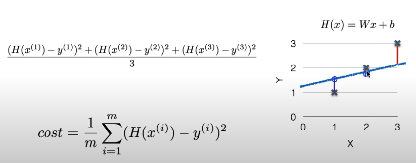

## Regression 
> 학습된 데이터를 기반으로 특정 입력 값에 대한 예측을 해주는 것

Regression model을 학습한다는 것은 하나의 가설을 세울 필요가 있다. 

### 1. Linear regression
    
1.1 (Linear) Hypothesis
        
    Ex) H(x) = Wx + b

1.2 Hypothesis
    
Which hypothesis is better? 

        
    거리를 통해 비교하여 좋은 것을 찾는다. (거리가 가까울 수록 좋은 것)

Cost(= Loss) function 
> 우리가 세운 가설과 실제 데이터가 얼마나 다른가를 나타내는 것

<strong>주로 차이의 제곱을 해준다.</strong> 

m: 데이터 갯수 

minimize cost(W,b): W, b가 최소가 되는 것