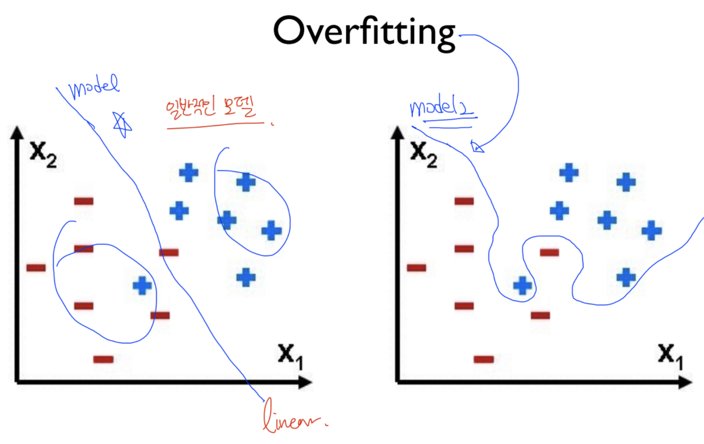

# Overfitting
> Training dataset에만 최적화되어, Test dataset 적용 시 제대로 동작하지 않는 문제 

왼쪽 그림을 model1, 오른쪽 그림을 model2라고 합시다. 
model1의 경우에는 classification을 진행할 때, (-) 그룹에 (+) 요소도 포함되어 있어 (+) 요소를 test의 입력으로 주었을 경우 이전에 (+) 요소에 대한 training을 진행했었기에 이를 파악할 수 있다. 
하지만, model2의 경우 training을 진행하면서 (+) 요소에 대한 학습이 되어 있지 않기 때문에 test에서 (+) 요소를 입력으로 줄 경우 제대로 동작하지 않게 된다. 

이러한 현상을 <strong>Overfitting</strong> 이라고 한다.

## Solution 
- More training data 
- Reduce the number of features 
- Regularization 

### Regularization 
> weight에 너무 큰 값들을 가지지 않도록 하기 위한 방법 

Cost function을 펴주기 위해 <strong>lamda(regularation strength) * 각각의 element를 제곱한 값의 합</strong>을 기존 Loss function에 더해준다. 

<strong>regularation strength 값이 커지면 regularation의 중요도가 높음을 의미</strong>